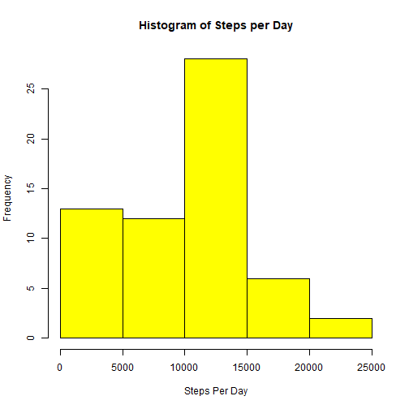
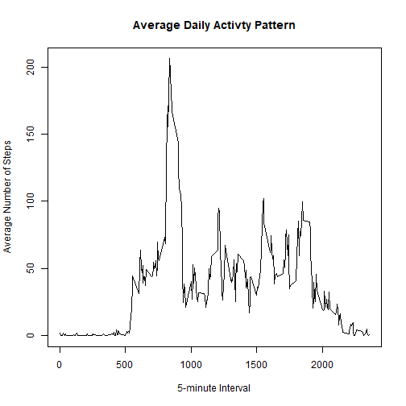
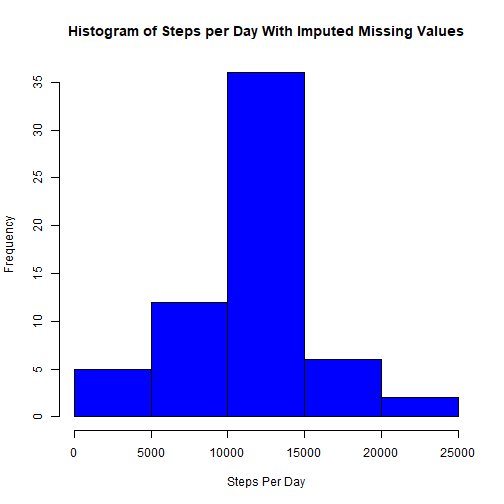
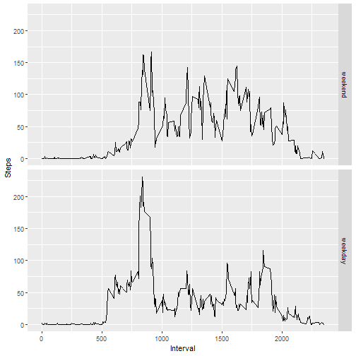

## Loading and preprocessing the data

1. Load the data (i.e. \color{red}{\verb|read.csv()|}read.csv())


```r
library(dplyr)
data <- read.csv("activity.csv")
data <- mutate(data, date = as.Date(date, format= "%Y-%m-%d"))
head(data)
```

```
##   steps       date interval
## 1    NA 2012-10-01        0
## 2    NA 2012-10-01        5
## 3    NA 2012-10-01       10
## 4    NA 2012-10-01       15
## 5    NA 2012-10-01       20
## 6    NA 2012-10-01       25
```

2. Process/transform the data (if necessary) into a format suitable for your analysis


```r
data <- mutate(data, date = as.Date(date, format= "%Y-%m-%d"))
str(data)
```

```
## 'data.frame':	17568 obs. of  3 variables:
##  $ steps   : int  NA NA NA NA NA NA NA NA NA NA ...
##  $ date    : Date, format: "2012-10-01" "2012-10-01" "2012-10-01" "2012-10-01" ...
##  $ interval: int  0 5 10 15 20 25 30 35 40 45 ...
```

## Mean total number of steps taken per day

1. Calculate the total number of steps taken per day


```r
stepsPerDay <- aggregate(list(Steps=data$steps), list(Date=data$date), FUN=sum, na.rm = TRUE)
head(stepsPerDay)
```

```
##         Date Steps
## 1 2012-10-01     0
## 2 2012-10-02   126
## 3 2012-10-03 11352
## 4 2012-10-04 12116
## 5 2012-10-05 13294
## 6 2012-10-06 15420
```

2. Make a histogram of the total number of steps taken each day


```r
hist(stepsPerDay$Steps, xlab = "Steps Per Day", col = "yellow", main = "Histogram of Steps per Day")
```



3. Calculate and report the mean and median of the total number of steps taken per day


```r
summary(stepsPerDay$Steps)
```

```
##    Min. 1st Qu.  Median    Mean 3rd Qu.    Max. 
##       0    6778   10395    9354   12811   21194
```

The mean for the total number of steps per day is 9354 and the median is 10395.

## Average daily activity pattern

1. Time series plot of the 5-minute interval (x-axis) and the average number of steps taken, averaged across all days (y-axis)


```r
stepsByInterval <- aggregate(list(Steps=data$steps), list(Interval=data$interval), FUN=mean, na.rm = TRUE)
with(stepsByInterval, plot(Interval, Steps, type = "l", main = "Average Daily Activty Pattern",
                           xlab = "5-minute Interval", ylab = "Average Number of Steps"))
```



2. 5-minute interval, on average across all the days in the dataset with the maximum number of steps


```r
stepsByInterval$Interval[which.max(stepsByInterval$Steps)]
```

```
## [1] 835
```


## Imputing missing values

1. Calculate and report the total number of missing values in the dataset (i.e. the total number of rows with NAs)


```r
rowsWithNAs <- sum(!complete.cases(data))
naInSteps <- sum(is.na(data$steps))
naInDate <- sum(is.na(data$date))
naInInterval <- sum(is.na(data$interval))
```

- The total number of rows with NAs is 2304.
- The total number of NAs in steps is 2304.
- The total number of NAs in date is 0.
- The total number of NAs in interval is 0.

2. Devise a strategy for filling in all of the missing values in the dataset. Use the mean for that 5-minute interval.


```r
newData <- data
head(newData)
```

```
##   steps       date interval
## 1    NA 2012-10-01        0
## 2    NA 2012-10-01        5
## 3    NA 2012-10-01       10
## 4    NA 2012-10-01       15
## 5    NA 2012-10-01       20
## 6    NA 2012-10-01       25
```

```r
naVector <- which(is.na(newData$steps))
for (value in naVector)
{
    newData$steps[value] <- stepsByInterval$Steps[stepsByInterval$Interval==newData$interval[value]]
}
```

3. Create a new dataset that is equal to the original dataset but with the missing data filled in.


```r
head(newData)
```

```
##       steps       date interval
## 1 1.7169811 2012-10-01        0
## 2 0.3396226 2012-10-01        5
## 3 0.1320755 2012-10-01       10
## 4 0.1509434 2012-10-01       15
## 5 0.0754717 2012-10-01       20
## 6 2.0943396 2012-10-01       25
```

4. Make a histogram of the total number of steps taken each day and Calculate and report the mean and median total number of steps taken per day. Do these values differ from the estimates from the first part of the assignment? What is the impact of imputing missing data on the estimates of the total daily number of steps?

- Histogram of the total number of steps taken each day

```r
stepsPerDayWithImputedValues <- aggregate(list(Steps=newData$steps), list(Date=newData$date), FUN=sum)
hist(stepsPerDayWithImputedValues$Steps, xlab = "Steps Per Day", col = "blue",
     main = "Histogram of Steps per Day With Imputed Missing Values")
```



- Mean and median total number of steps taken per day

```r
summary(stepsPerDayWithImputedValues$Steps)
```

```
##    Min. 1st Qu.  Median    Mean 3rd Qu.    Max. 
##      41    9819   10766   10766   12811   21194
```

```r
mean(stepsPerDayWithImputedValues$Steps)
```

```
## [1] 10766.19
```

```r
median(stepsPerDayWithImputedValues$Steps)
```

```
## [1] 10766.19
```

The values differ compared to the initial estimates since we have imputed the missing values in the number of steps data. We now have a complete data set to use for calculating a more accurate estimate.

## Differences in activity patterns between weekdays and weekends

1. Create a new factor variable in the dataset with two levels -- "weekday" and "weekend" indicating whether a given date is a weekday or weekend day.


```r
weekdaysVector <- c('Monday', 'Tuesday', 'Wednesday', 'Thursday', 'Friday')
newData$day <- factor((weekdays(newData$date) %in% weekdaysVector),
                       levels=c(FALSE, TRUE),
                       labels=c("weekend", "weekday"))
str(newData)
```

```
## 'data.frame':	17568 obs. of  4 variables:
##  $ steps   : num  1.717 0.3396 0.1321 0.1509 0.0755 ...
##  $ date    : Date, format: "2012-10-01" "2012-10-01" "2012-10-01" "2012-10-01" ...
##  $ interval: int  0 5 10 15 20 25 30 35 40 45 ...
##  $ day     : Factor w/ 2 levels "weekend","weekday": 2 2 2 2 2 2 2 2 2 2 ...
```

```r
levels(newData$day)
```

```
## [1] "weekend" "weekday"
```

2. Make a panel plot containing a time series plot (i.e. type = "l") of the 5-minute interval (x-axis) and the average number of steps taken, averaged across all weekday days or weekend days (y-axis).


```r
stepsByIntervalAndDay <- aggregate(list(Steps=newData$steps),
                                   list(Interval=newData$interval, Day=newData$day), FUN=mean)
head(stepsByIntervalAndDay)
```

```
##   Interval     Day       Steps
## 1        0 weekend 0.214622642
## 2        5 weekend 0.042452830
## 3       10 weekend 0.016509434
## 4       15 weekend 0.018867925
## 5       20 weekend 0.009433962
## 6       25 weekend 3.511792453
```

```r
library(ggplot2)
ggplot(stepsByIntervalAndDay, aes(x=Interval, y=Steps)) + geom_line() + facet_grid(rows = vars(Day))
```




